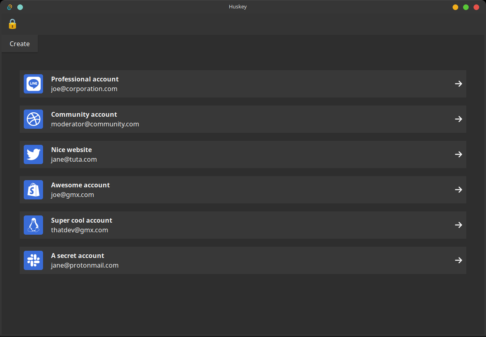
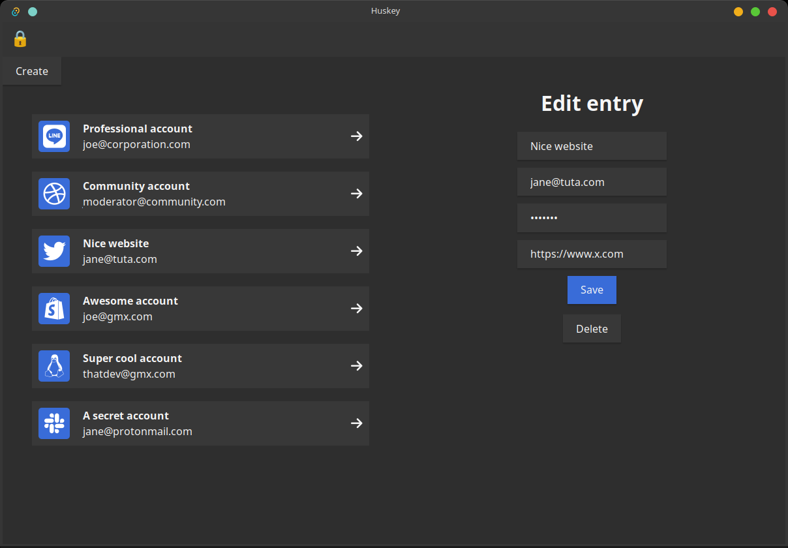

# Huskey

## Overview
Huskey is a work in progress project I created for learning the intricacies of a password manager and its cryptography. It was also created as a fun side project to be more familiar with Rust.

## Screenshots
### Opened vault

### Editing an entry in a vault

## Disclaimer 
This project is not finished nor polished to the quality standard I usually apply to myself. I decided to publish it anyway to put it out there.

## Features
* **Secure storage** : Store passwords safely, they are encrypted at rest 
* **Graphical user interface** : For ease of use (and for your friends using windows)
* **Cross platform** : Thanks to Rust cross compilation
* **Blazingly fast** 

### Built using 
* [Tauri](https://tauri.app) (a toolchain used to create cross platform desktop apps, the spiritual successor of [electron](https://www.electronjs.org/fr/))
* Rust
* Vue3 (because I used it sometime ago)

### Cryptography used
* [SHA512](https://fr.wikipedia.org/wiki/SHA-2) : for hashing the users password
* [PBKDF2(HMAC-SHA512)](https://en.wikipedia.org/wiki/PBKDF2): for reducing vulnerability against brute force attacks and calculating the actual encryption/decryption key
* [AES-256-GCM](https://www.cryptosys.net/pki/manpki/pki_aesgcmauthencryption.html) : for encrypting the database file and assuring its integrity (aka *military grade encryption*)

### Improvements ideas / roadmap
- [ ] Look into code coverage reports with [tarpaulin](https://github.com/xd009642/tarpaulin)
- [ ] Adding GUI tests with [tauri-driver](https://tauri.app/v1/guides/testing/webdriver/introduction/)
- [ ] Add 2FA support (TOTP)
- [ ] Support for other encryption algorithms like ChaCha20
- [ ] Protecting the process against low priviledged attackers ? (using the secmem-proc crate)

## Codebase tour
* All the rust logic of the application is contained in the `lib` folder
* All the GUI code of the application is contained in the `huskey-gui` folder
* A workflow testing the rust logic is found in the `.github` folder

## License
Huskey is licensed under the GNUGPLv3 License. See the [COPYING](./COPYING) file for details.

## Contact 
If you're looking for a passionate graduate engineer with 3 years of work experience [look no further](https://www.linkedin.com/in/theo-fourniez/)
See my other projects [on my github profile](https://github.com/Theo-Fourniez)
